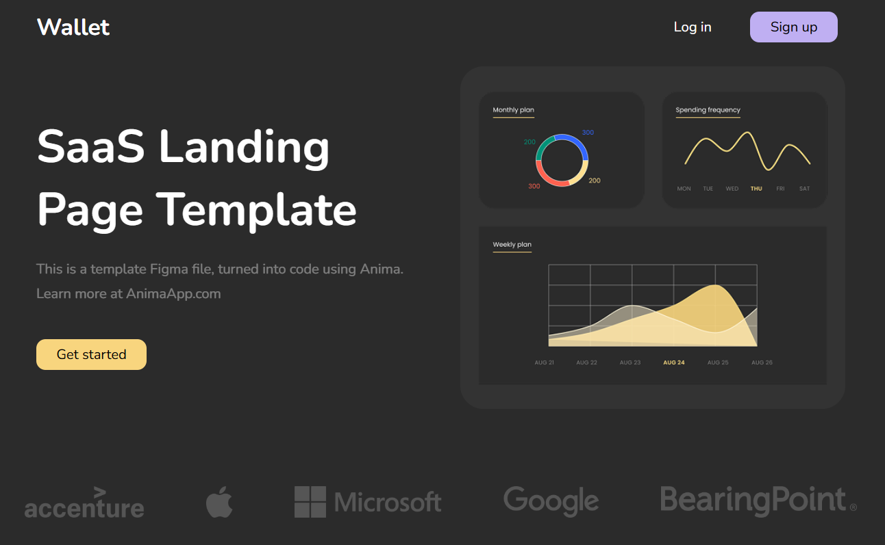
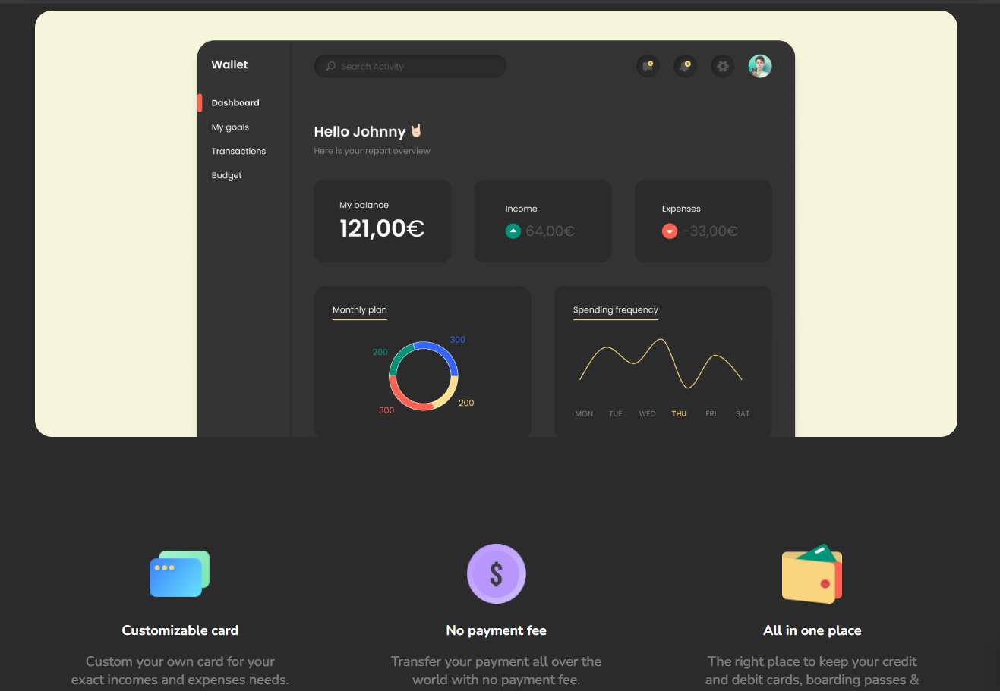
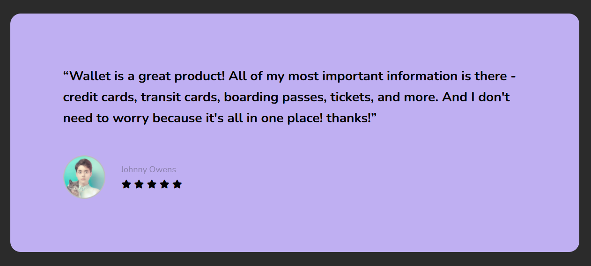
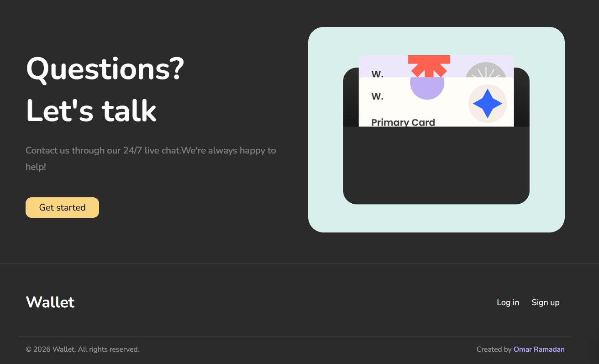

# Wallet SaaS Landing Page

**Live Preview:** [https://saas-landing-iota-two.vercel.app/](https://saas-landing-iota-two.vercel.app/)

A clean, responsive, and modern SaaS landing page template named Wallet. This landing page was created using semantic HTML5 and vanilla CSS.

## Features

- Customizable Card: Custom your own card for your exact income and expense needs.
- No Payment Fee: Transfer payments globally with zero transfer fees.
- All-in-One Wallet: A secure place to manage credit/debit cards, boarding passes, and tickets.
- Client Testimonial: Read-only ratings and testimonial display.
- Contact Section: Call-to-action for support and live chat.

## Technologies Used

- HTML5
- CSS3 (Vanilla CSS)
- Font Awesome (for icons)

## Screenshots

### Hero Section

### Features Section

### Reviews Section

### Contact Section

## Getting Started

To view and run the project locally:

1. Clone or download this repository.
2. Open index.html in any modern web browser.
3. Alternatively, run it using a local development server (such as Live Server in VS Code).

## Credits

- Figma Template Design: Anima
- Frontend Implementation: Omar Ramadan
